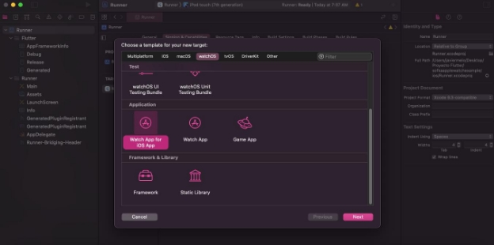
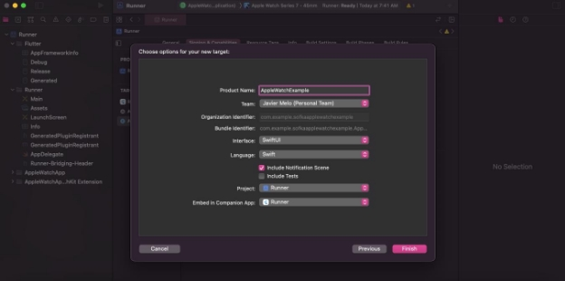
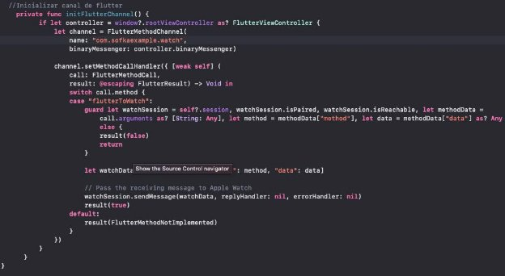
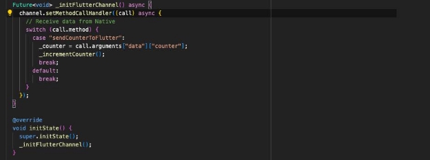
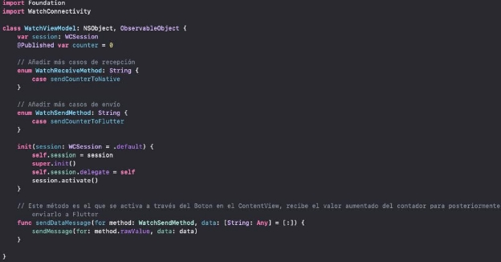
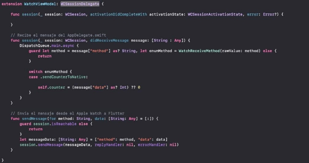
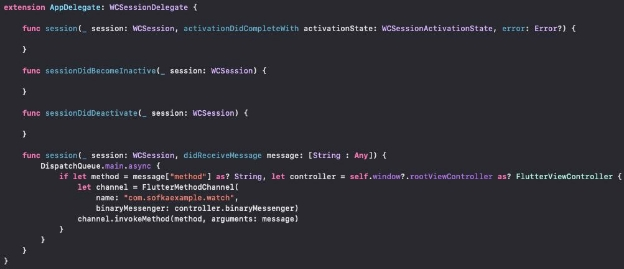
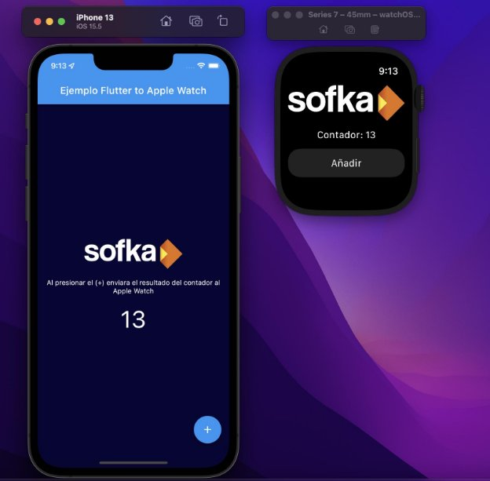

# Implementación de extensión de Apple Watch(SwiftUI) en proyecto Flutter 

### Añadir Apple Watch Extension en el proyecto Flutter

1. Una vez creado el proyecto flutter de manera común se debe abrir el proyecto Xcode para  agregar  la  extensión  del  Apple  Watch.  Para  esto  se  debe  seleccionar File>New>Target. 

2. Se debe seleccionar que el tipo de interfaz sea SwiftUI y el lenguaje igual, se debe deseleccionar el “Include Tests” y el “Include Notification Scene”. Una vez hecho esto solo se debe dar click en finalizar. 

### Añadir el canal que permite recibir información y enviarla al Apple Watch

1. Se debe ir al archivo AppDelegate y crear el método que permita inicializar el canal y definir cada uno de los métodos que se esperar de dicho canal. Lo llamaremos con el identificador “com.sofkaexample.watch” y por razones del ejercicio el método principal que llamaremos sera flutterToWatch. Este case es el encargado de recibir los datos de Flutter y posteriormente enviarla al Apple Watch, pero por ahora solo se esta comunicando con el proyecto iOS.** 

### Añadir el canal que permite enviar y recibir información del Apple Watch 

1. Así como se creo el canal que recibe información desde el proyecto Swift y enviarla Apple  Watch,  Se  debe  crear  el  método  desde  flutter  que  permita  crear  la comunicación. El canal en Flutter debe llevar el mismo identificador previamente definido “com.sofkaexample.watch” y el mismo nombre del caso “flutterToWatch”. Por  temas  del  ejercicio  lo  haremos  en  la  misma  clase(main.dart),  pero  es recomendable según la arquitectura de la aplicación separarlo en otra clase que sirva  de  Source  de  todos  los  métodos  que  se  crearan  para  enviar  o  recibir información. 

2. Asimismo cómo se crea otro método que es el encargado de recibir la información del Apple Watch y tenerla en Flutter. Con este ejemplo se tendría una comunicación bidireccional entre Flutter y el AppleWatch. Para este caso lo que se enviaría es el incremento de un contador y lo que se recibiría es el incremento del mismo contador pero hecho desde el Apple Watch. 

### Crear la interfaz Gráfica en el Apple Watch y el ViewModel 

1. Para esta parte se requiere de  dos  partes  la  de  crear  el  ViewModel  y  la  de  la  propia  interfaz del  Apple Watch, para  que la vista se comunique con  el  ViewModel  define  una  instancia hacia el mismo de tipo  @ObservableObject.  En  este  código  se  gráfica  el  valor  del  contador recibido de Flutter pero  así mismo se modifica desde el  Apple Watch y al mismo tiempo  se  envía  mediante  un  método  en el ViewModel a Flutter.  
2. En el view model se definen todas las operaciones de recepción de la información y de envío de la información, se crea la WCSessionDelegate que es la encargada de esto. 

### Añadir el WatchSession que permitiría hacer de puente entre Flutter, El proyecto iOS y el Proyecto del AppleWatch

1. En el AppDelegate.swift se debe incur el canal de flutter y verificar si la WCSession esta soportado. 

2. Se crea el AppDelegate encargado de la comunicación entre Flutter, El proyecto iOS y el Proyecto del Apple Watch. 

### El resultado final sera una app Flutter comunicada con una App Extension para el Apple Watch 

### Referencias

- [**https://medium.com/kbtg-life/adding-apple-watch-to-flutter-app-via-flutter- method-channel-f1443532d94e**](https://medium.com/kbtg-life/adding-apple-watch-to-flutter-app-via-flutter-method-channel-f1443532d94e) 
- [**https://docs.flutter.dev/development/platform-integration/ios/apple-watch**](https://docs.flutter.dev/development/platform-integration/ios/apple-watch)
